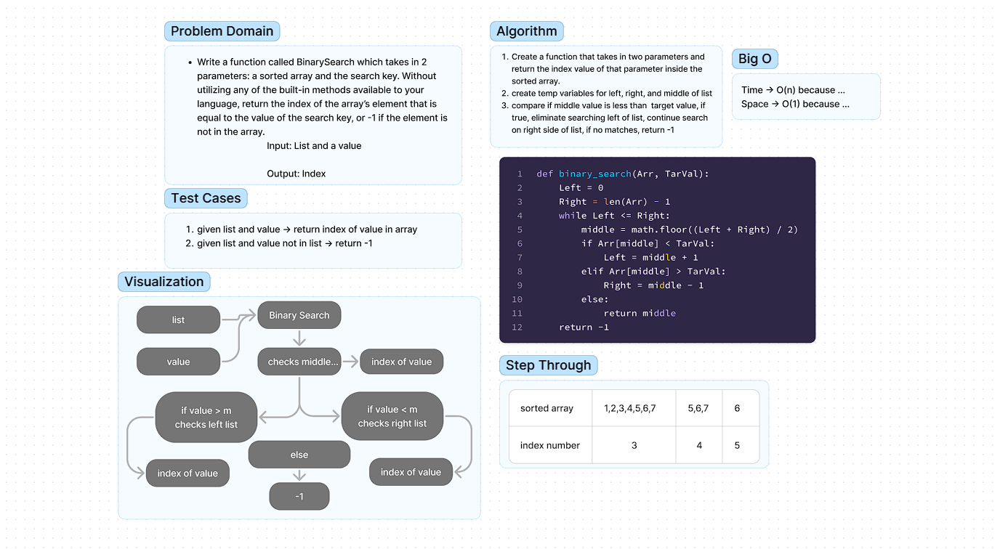

# Challenge Title
<!-- Description of the challenge -->
Write a function called BinarySearch which takes in 2 parameters: a sorted array and the search key. Without utilizing any of the built-in methods available to your language, return the index of the array’s element that is equal to the value of the search key, or -1 if the element is not in the array.

## Whiteboard Process
<!-- Embedded whiteboard image -->

## Approach & Efficiency
<!-- What approach did you take? Why? What is the Big O space/time for this approach? -->
The approach we decided to take was to determine the middle of the length of the list and then based on the value of the middle index, we were able to take away half the list and then start the search again. The Big O for time would be O(n) because of this single list that you are iterating through, but could be increased depending on how deep you go in the search. the Big O space would be O(1) since there is only one list.

## Solution
<!-- Show how to run your code, and examples of it in action -->
To run the code you would just need to do binary_search(Arr, TarVal)
