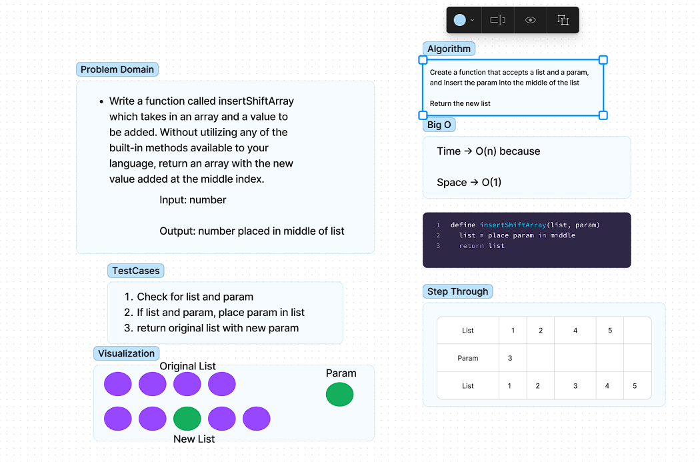

# Challenge Title
<!-- Description of the challenge -->
Write a function called insertShiftArray which takes in an array and a value to be added. Without utilizing any of the built-in methods available to your language, return an array with the new value added at the middle index.

## Whiteboard Process
<!-- Embedded whiteboard image -->

## Approach & Efficiency
<!-- What approach did you take? Why? What is the Big O space/time for this approach? -->
The approach we decided to take was to determine the difference(modulo) of the length of the list and then insert or place the parameter into the middle of the original list. The Big O for time would be O(n) because of this single list that you are iterating through, the Big O space would be O(1) since there is only one list.

## Solution
<!-- Show how to run your code, and examples of it in action -->
To run the code you would just need to do insertShiftArray(list, param)
