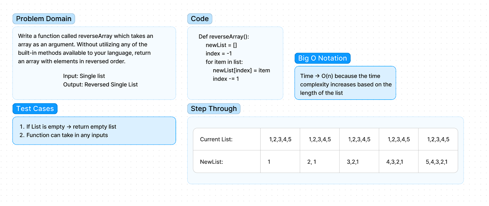

# Challenge Title
<!-- Description of the challenge -->
Write a function called reverseArray which takes an array as an argument. Without utilizing any of the built-in methods available to your language, return an array with elements in reversed order.

## Whiteboard Process
<!-- Embedded whiteboard image -->

## Approach & Efficiency
<!-- What approach did you take? Why? What is the Big O space/time for this approach? -->
I used indexes and list to come up with the solution, using negative indexes, the list gets reversed by increasing the nuumber of the negative index as the loop continues through the original list.

## Solution
<!-- Show how to run your code, and examples of it in action -->
reverseArray()
